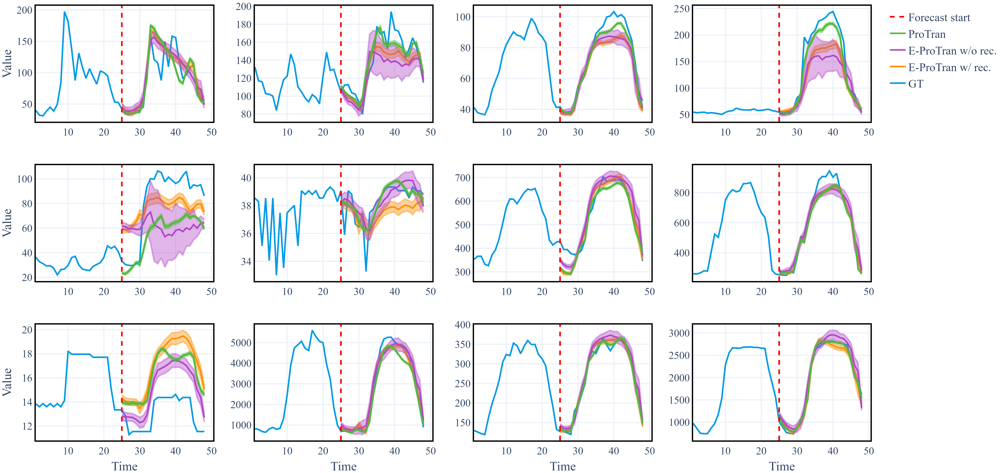
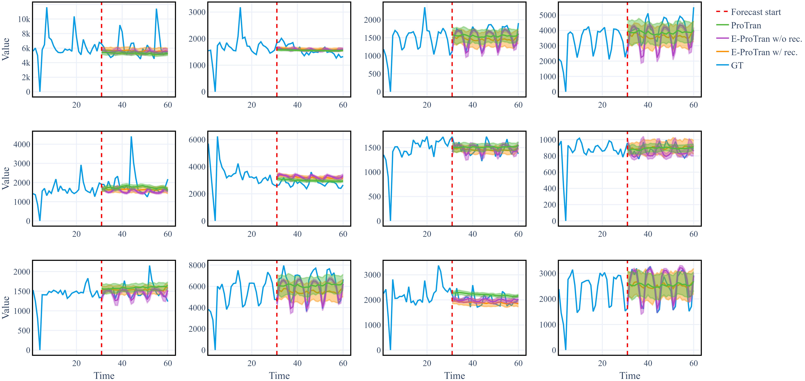
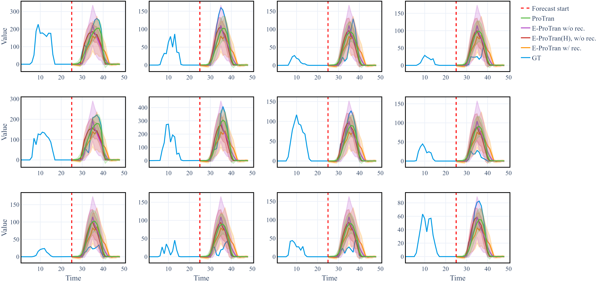

# E-ProTran: Efficient Probabilistic Transformers for Forecasting 

This Repo belongs to the paper *E-ProTran: Efficient Probabilistic Transformers for Forecasting* published in the [ICML 2024 Workshop on Structured Probabilistic Inference & Generative Modeling, 2024](https://spigmworkshop2024.github.io/).

## Important Update
In [Probabilistic Transformer (ProTran)](https://proceedings.neurips.cc/paper/2021/hash/c68bd9055776bf38d8fc43c0ed283678-Abstract.html) the authors report their ELBO as

```math
\begin{align*}
\ln\left(p_\theta\left(x_{1:T} \vert x_{1:C}\right)\right) &\geq \mathbf{E}_{z_{1:T} \sim q_\phi(z_{1:T}\vert x_{1:T})}\left[\ln\left(p_\theta\left(x_{1:T} \vert z_{1:T}\right)\right)\right] - \mathrm{KL}\left( q_\phi(z_{1:T}\vert x_{1:T}) \Vert p_{\theta}(z_{1:T}\vert x_{1:C})\right)\\
    & =\sum_{t=1}^T \mathbf{E}_{z_{1:T} \sim q_\phi(z_{1:T}\vert x_{1:T})}\left[\ln\left(p_\theta\left(x_{t} \vert z_{t}\right)\right)\right] - \mathrm{KL}\left( q_\phi(z_t\vert z_{1:t-1}, x_{1:T}) \Vert p_{\theta}(z_t \vert z_{1:t-1}, x_{1:C})\right)\\
    & = \left(\sum_{t=1}^T \mathbf{E}_{z_{1:T} \sim q_\phi(z_{1:T}\vert x_{1:T})}\left[\ln\left(p_\theta\left(x_{t} \vert z_{t}\right)\right)\right]\right) - \mathrm{KL}\left( q_\phi(z_1\vert x_{1:T}) \Vert p_{\theta}(z_1 \vert x_{1:C})\right) \\
    &\quad - \sum_{t=2}^T \mathrm{KL}\left( q_\phi(z_t\vert z_{1:t-1}, x_{1:T}) \Vert p_{\theta}(z_t \vert z_{1:t-1}, x_{1:C})\right).
\end{align*}
```

However, fully written out the ELBO is:

```math 
\begin{align*}
& \left(\sum_{t=1}^T \mathbf{E}_{z_{1:T} \sim q_\phi(z_{1:T}\vert x_{1:T})}\left[\ln\left(p_\theta\left(x_{t} \vert z_{t}\right)\right)\right]\right) - \mathrm{KL}\left( q_\phi(z_1\vert x_{1:T}) \Vert p_{\theta}(z_1 \vert x_{1:C})\right) \\
& \quad - \sum_{t=2}^T \underset{\text{Missing Expectation}}{\underbrace{\mathbf{E}_{z_{1:t-1}\sim q_\phi(z_{1:t-1}\vert x_{1:T})}}}\left[\mathrm{KL}\left( q_\phi(z_t\vert z_{1:t-1}, x_{1:T}) \Vert p_{\theta}(z_t \vert z_{1:t-1}, x_{1:C})\right)\right]
\end{align*}
```

From the second formulation it becomes clear that to approximate the expectation $`{\mathbf{E}_{z_{1:t-1}\sim q_\phi(z_{1:t-1}\vert x_{1:T})}}`$ in the loss, the KL-divergence $\mathrm{KL}\left( q_\phi(\cdot\vert z_{1:t-1}, x_{1:T}) \Vert p_{\theta}(\cdot \vert z_{1:t-1}, x_{1:C})\right)$ should be evaluated at samples $z_{1:t-1}\sim q_\phi(z_{1:t-1}\vert x_{1:T})$. 

At the time of publishing, our re-implementation of their model wrongly evaluated $p_{\theta}(\cdot \vert z_{1:t-1}, x_{1:C})$ at samples from $z_{1:t-1}\sim p_\theta(z_{1:t-1}\vert x_{1:C})$. We have updated our code to correctly calculate the ELBO of the ProTran baseline. We have kept the old version of our code as `deprecated` to ensure reproducability of our experiments.

The corrected version can be found in `source/models/ProTranHierarchy`. It uses the same `ProTran` class (from `source/models/protran_model`) but requires the flag `deprecated = False` in the constructor. Our original code is in `source/models/ProTranHierarchyDeprecated`.


## Code
This repository contains the code for our model, E-ProTran, as well as our implementation of the baseline model, [Probabilistic Transformer (ProTran)](https://proceedings.neurips.cc/paper/2021/hash/c68bd9055776bf38d8fc43c0ed283678-Abstract.html) by Binh Tang and David S. Matteson as the code was not publicly available.

Our model (E-ProTran) is implemented with the name `ForeTran` (for Forecasting Transformer), while ProTran is implemented under the name `ProTran`. We use Python version 3.10.13 for our implementation.

### Structure
The file structure of the repository is as follows:
```text
├── README.md           : this file
├── requirements.txt    : required packages to run the code
├── run.py              : script for running the models
├── example_cfgs/..     : example config files to run our models
├── media/..            : visualizations of the predictions from the paper
└── source              : main folder for the implementation
    |
    ├── __init__.py
    ├── callbacks.py          : callbacks for the models (for tracking certain statistics/plotting)
    ├── dataset_gluonts.py    : utils to download datasets from GluonTS, fitting them to our framework, and appending covariates
    └── models                : folder for the model implementation
        |
        ├── __init__.py     
        ├── AbstractBaseModel.py            : base classes for the models, implements shared functionality
        ├── activation_functions.py         : activation functions for the models
        ├── archs.py                        : functions for building the models
        ├── conditional_prior.py            : conditional prior architectures
        ├── decoder.py                      : decoder (emission model) architectures
        ├── encoder.py                      : encoder (posterior) architectures
        ├── ForetranTransformer.py          : classes to create our E-ProTran transformer
        ├── likelihood.py                   : likelihood functions
        ├── model_neat.py                   : model implementation for E-ProTran
        ├── protran_model.py                : model implementation for ProTran
        ├── ProtranHierarchy.py             : corrected version of the ProTran hierarchy
        ├── ProtranHierarchyDeprecated.py   : classes to create the ProTran hierarchy, deprecatred version with the aforementioned sampling error
        └── TransformerBNEncoderLayer.py    : unused in the paper, outdated implementation of a transformer for E-ProTran
```
The example configs are in `example_cfgs/` and can be used to run the models with the `run.py` script. They are representative of the configurations used in the paper, but they do not necessarily contain the best training hyperparameters in terms of learning rate and learning rate decay.

### Running the Code
Install the required packages with:
```bash
pip install -r requirements.txt
```
Then, you can run the models with the following command:
```bash
python run.py --yaml_file example_cfgs/eprotran_electricity.yaml
```
Or, more generally:
```bash
python run.py --yaml_file <path_to_config> --log_dir <optional logging directory>
```


## Forecast Examples
### Electricity

### Wikipedia

### Solar


## Citation
Authors: [Batuhan Koyuncu](https://www.batukoyuncu.com/), [Tim Nico Bauerschmidt](https://iamgine.github.io/), [Isabel Valera](https://machinelearning.uni-saarland.de/isabel-valera/)

**If you find this work useful, please consider citing it:**
```bibtex
 @inproceedings{
    E-ProTran,
    title={E-ProTran: Efficient Probabilistic Transformers for Forecasting},
    author={Batuhan Koyuncu and Tim Nico Bauerschmidt and Isabel Valera},
    booktitle={ICML 2024 Workshop on Structured Probabilistic Inference {\&} Generative Modeling},
    year={2024},
    url={https://openreview.net/forum?id=Db5Ryi9Dr8}
}
```
